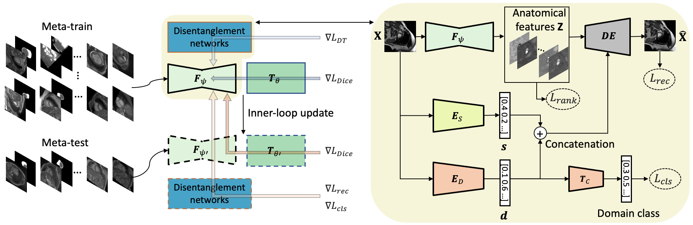
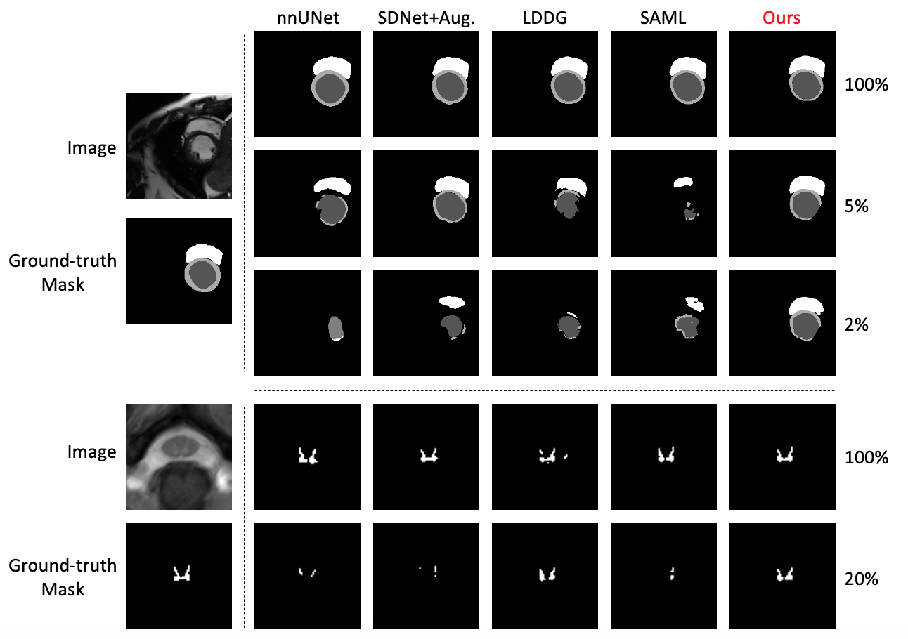

# Semi-supervised Meta-learning with Disentanglement for Domain-generalised Medical Image Segmentation


This repository contains the official Pytorch implementation of [Semi-supervised Meta-learning with Disentanglement for Domain-generalised Medical Image Segmentation](https://arxiv.org/abs/2106.13292)(accepted by [MICCAI 2021](https://miccai2021.org/en/) as Oral).

The repository is created by [Xiao Liu](https://github.com/xxxliu95), [Spyridon Thermos](https://github.com/spthermo), [Alison O'Neil](https://vios.science/team/oneil), and [Sotirios A. Tsaftaris](https://www.eng.ed.ac.uk/about/people/dr-sotirios-tsaftaris), as a result of the collaboration between [The University of Edinburgh](https://www.eng.ed.ac.uk/) and [Canon Medical Systems Europe](https://eu.medical.canon/). You are welcome to visit our group website: [vios.s](https://vios.science/)

# System Requirements
* Pytorch 1.5.1 or higher with GPU support
* Python 3.7.2 or higher
* SciPy 1.5.2 or higher
* CUDA toolkit 10 or newer
* Nibabel
* Pillow
* Scikit-image
* TensorBoard
* Tqdm

# Preprocessing

You need to first change the dirs in the scripts of preprocess folder. Download the M&Ms data and run ```split_MNMS_data.py``` to spplit the original dataset into different domains. Then run ```save_MNMS_2D.py``` to save the original 4D data as 2D numpy arrays. Finally, run ```save_MNMS_re.py``` to save the resolution of each datum. 

# Training
Note that the hyperparameters in the current version are tuned for BCD to A cases. For other cases, the hyperparameters and few specific layers of the model are slightly different. To train the model with 5% labeled data, run:
```
python train_meta.py -e 150 -c cp_dgnet_meta_5_tvA/ -t A -w DGNetRE_COM_META_5_tvA -g 0
```
Here the default learning rate is 4e-5. You can change the learning rate by adding ```-lr 0.00002``` (sometimes this is better).

To train the model with 100% labeled data, try to change the training parameters to:
```
k_un = 1
k1 = 20
k2 = 2
```
The first parameter controls how many iterations you want the model to be trained with unlabaled data for every iteration of training. ```k1 = 20``` means the learning rate will start to decay after 20 epochs and ```k2 = 2``` means it will check if decay learning every 2 epochs.

Also, change the ratio ```k=0.05``` (line 221) to ```k=1``` in ```mms_dataloader_meta_split.py```.

Then, run:
```
python train_meta.py -e 80 -c cp_dgnet_meta_100_tvA/ -t A -w DGNetRE_COM_META_100_tvA -g 0
```
Finally, when training the model, changing the ```resampling_rate=1.2``` (line 47) in ```mms_dataloader_meta_split.py``` to 1.1 - 1.3 may cause better results. This will change the rescale ratio when preprocessing the images, which will affect the size of the anatomy of interest.

# Inference
After training, you can test the model:
```
python inference.py -bs 1 -c cp_dgnet_meta_100_tvA/ -t A -g 0
```
This will output the DICE and Hausdorff results as well as the standard deviation. Similarly, changing the ```resampling_rate=1.2``` (line 47) in ```mms_dataloader_meta_split_test.py``` to 1.1 - 1.3 may cause better results.

# Datasets
We used two datasets in the paper: [Multi-Centre, Multi-Vendor & Multi-Disease
Cardiac Image Segmentation Challenge (M&Ms) datast](https://www.ub.edu/mnms/) and [Spinal cord grey matter segmentation challenge dataset](http://niftyweb.cs.ucl.ac.uk/challenge/index.php). The dataloader in this repo is only for M&Ms dataset.

# Qualitative results


# Citation
```
@inproceedings{liu2021semi,
  title={Semi-supervised Meta-learning with Disentanglement for Domain-generalised Medical Image Segmentation},
  author={Liu, Xiao and Thermos, Spyridon and O’Neil, Alison and Tsaftaris, Sotirios A},
  booktitle={International Conference on Medical Image Computing and Computer-Assisted Intervention},
  pages={307--317},
  year={2021},
  organization={Springer}
}
```

# Acknowlegement
Part of the code is based on [SDNet](https://github.com/spthermo/SDNet), [MLDG](https://github.com/HAHA-DL/MLDG), [medical-mldg-seg](https://github.com/Pulkit-Khandelwal/medical-mldg-seg) and [Pytorch-UNet](https://github.com/milesial/Pytorch-UNet).

# License
All scripts are released under the MIT License.
